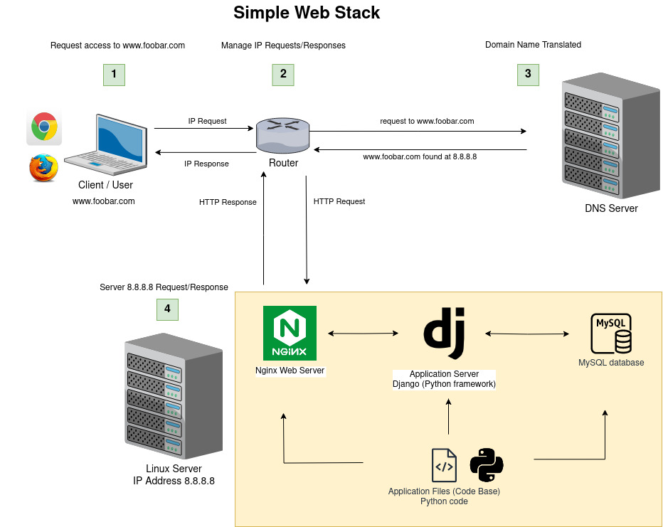

# 0. Simple web stack

## Introduction

###  What is a Technology Stack?

Think of a technology stack as a `hamburger`. Just like a hamburger, a technology stack consists of various ingredients that come together to create a complete solution. 

The structure of any good hamburger stays the same, no matter what `ingredients` we are mixing:

- __The operating system__ as the `plate` that supports and holds the hamburger together, Linux sets the foundation for the stack model.
- __Front-end or client-side__ as the `bread` in the hamburguer. It's the outer layer enhancing the user experience.
- __HTTP Server__ as the `meat` that is the core of a hamburger.
- __App Server or development platform__  as the `condiments` that add extra taste and variety to a hamburger. These would be the `libraries` and `frameworks` to provide additional features and make development more efficient
- __Database Server__ as `cheese` that is often added to a hamburger.

### Popular Technology Stacks
Some of the more popular technology stacks are shown below:
  

__Source__: [https://ddi-dev.com/blog/](https://ddi-dev.com/blog/programming/how-choose-technology-stack-web-application-development/)

### The Four Layers of a LAMP Stack

Linux based web servers consist of four software components.

- __Linux__: The `operating system (OS)` is the first one. All other layers run on top of this layer.
- __Apache__: The second layer consists of web server software, typically `Apache Web Server` doing functions like handling incoming requests, serving web pages, managing connections and sessions and logging and monitoring.
- __MySQL__: Is the third layer where databases stand. MySQL stores and retrieves data. MySQL usually sits on top of the Linux layer alongside Apache/layer 2.
- __PHP__: Sitting on the top is the fourth and final layer. The scripting layer consists of PHP and/or other similar web programming languages. Websites and Web Applications run within this layer.

  

__Source__: [https://www.liquidweb.com/](https://www.liquidweb.com/kb/what-is-a-lamp-stack/)

## Simple web stack
A lot of websites are powered by simple web infrastructure, a lot of time it is composed of a single server with a [LAMP stack](https://en.wikipedia.org/wiki/LAMP_%28software_bundle%29)

The following is a server web infrastructure that hosts the website that is reachable via `www.foobar.com`.

  

### Specifics about this infrastructure

- __What is a server__

A `server` is a piece of computer hardware or software that provides functionality for other programs or devices, called `clients`

- __What is the role of the domain name__

DNS is the technology that translates human-adapted, text-based domain names to machine-adapted, numerical-based IP addresses.

- __What type of DNS record www is in www.foobar.com__

The `www` in `www.foobar.com` is an A` record`. __A Records__ are the simplest type of DNS records, and one of the primary records used in DNS servers.

- __What is the role of the web server__

The web server's role is to handle HTTP requests from clients (such as web browsers) and serve the requested web pages or resources

Web servers handle HTTP requests and responses only.(static content)

A `web server` is a __software__ that delivers web pages. A `server` is an actual computer.

- What is the role of the application server

An application server hosts and manages web applications or services. A popular example of appication server is `Node.js`.

An application server generates dynamic content.

- __What is the role of the database__

The database stores and manages structured data used by the web application.

- __What is the server using to 
communicate with the computer of the user requesting the website__

The server communicates with the user's computer by using the HTTP (Hypertext Transfer Protocol) protocol.

### Issues about this infrastructure

- __SPOF(Single Points of Failure)__

The failure of a single component can lead to the entire system becoming non-functional. Without backup systems, the failure of any critical component can cause a collapse of the entire infrastructure.

- __Downtime when maintenance needed__

The entire system needs to be shut down, resulting in downtime and an inability to handle client requests during that period. This lack of redundancy and high availability can negatively impact user experience and productivity.

- __Cannot scale if too much incoming traffic__

Having only one server that hosts all the required components can lead to problems when there are too many people trying to access the website at the same time. The server may become overwhelmed and run out of resources, like processing power and memory. 

### Bibliography:

- https://www.altamira.ai/blog/how-to-choose-your-technology-stack/
- https://www.liquidweb.com/kb/what-is-a-lamp-stack/
- https://ddi-dev.com/blog/programming/how-choose-technology-stack-web-application-development/
- https://oa-angel26.medium.com/web-infrastructure-design-4634a2e1b27c

