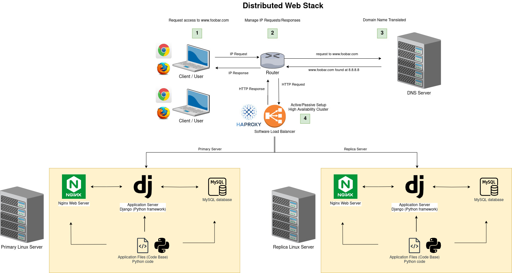

# 1. Distributed web infrastructure 

## Table of contents

  * [Distributed web infrastructure](#distributed-web-infrastructure)
      * [Specifics about this infrastructure](#specifics-about-this-infrastructure)
      * [Issues about this infrastructure](#issues-about-this-infrastructure)
  * [Bibliography](#bibliography)
  * [Tools](#tools)

## Distributed web infrastructure

The following is a distributed web infrastructure that hosts the website that is reachable via `www.foobar.com`.

  

### Specifics about this infrastructure

- For every additional element, why you are adding it
- What distribution algorithm your load balancer is configured with and how it works
- Is your load-balancer enabling an Active-Active or - Active-Passive setup, explain the difference between both
- How a database Primary-Replica (Master-Slave) cluster works
- What is the difference between the Primary node and the Replica node in regard to the application

### Issues about this infrastructure

- __SPOF(Single Points of Failure)__

- __Security issues (no firewall, no HTTPS)__

- __No monitoring__

## Bibliography:

- https://en.wikipedia.org/wiki/HAProxy
- https://www.jscape.com/blog/active-active-vs-active-passive-high-availability-cluster
- https://www.thegeekstuff.com/2016/01/load-balancer-intro/

## Tools:
- https://app.diagrams.net/
