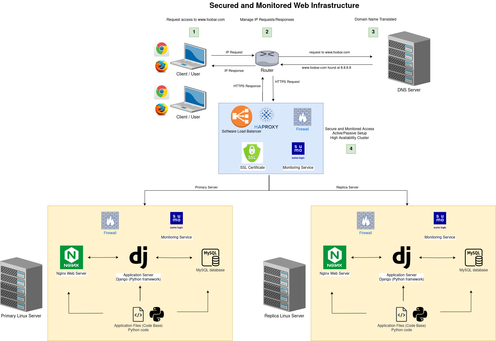

# 2. Secured and monitored web infrastructure

## Table of contents

  * [Secured and monitored wen infrastructure](#secured-and-monitored-web-infrastructure)
      * [Specifics about this infrastructure](#specifics-about-this-infrastructure)
      * [Issues about this infrastructure](#issues-about-this-infrastructure)
  * [Bibliography](#bibliography)
  * [Tools](#tools)

## Secured and monitored web infrastructure

The following is three server web infrastructure that hosts the website `www.foobar.com`, it must be secured, serve encrypted traffic, and be monitored

  

### Specifics about this infrastructure

- __Explain why are you adding every additional element__

  - 3 firewalls to filter incoming and outgoing network traffic.
  - 1 SSL certificate to encrypted the data transmitted between the client and the server

  - 3 monitoring clients to have visibility into the status, performance, and health of the servers.

- __What are firewalls for__

Firewalls are network security devices that act as a barrier between a trusted internal network and an untrusted external network (typically the internet)

- __Why is the traffic served over HTTPS__

HTTPS encrypts the data during transmission using SSL/TLS (Secure Sockets Layer/Transport Layer Security) protocols.

- __What monitoring is used for__

Monitoring is the process of continuously observing and collecting data on various aspects of a system, such as servers, applications, networks, or databases. Monitoring helps track the performance, availability, and health of these components

- __How the monitoring tool is collecting data__

Monitoring tools collect data by various methods, including agent-based monitoring, agentless monitoring, or log analysis. 

- __Explain what to do if you want to monitor your web server QPS__

### Issues about this infrastructure

- __Why terminating SSL at the load balancer level is an issue__

Terminating SSL at the load balancer level is an issue because the traffic between the load balancer and the web servers is unencrypted

- __Why having only one MySQL server capable of accepting writes is an issue__

Having only one MySQL server capable of accepting writes is an issue because if the master goes down, the application cannot write to the database anymore

- __Why having servers with all the same components (database, web server and application server) might be a problem__

Having servers with all the same components (database, web server and application server) might be a problem because their consumption will not grow the same way between each of them (we might want to have more database servers than application servers for instance). 

## Bibliography:

- https://cyberhoot.com/cybrary/secure-socket-layer-ssl/
- https://www.netreo.com/blog/network-and-infrastructure-monitoring-is-every-tool-the-same/
- https://levelup.gitconnected.com/system-design-interview-basics-difference-between-api-gateway-and-load-balancer-60260b568121
- https://oa-angel26.medium.com/web-infrastructure-design-4634a2e1b27c

## Tools:
- https://app.diagrams.net/
