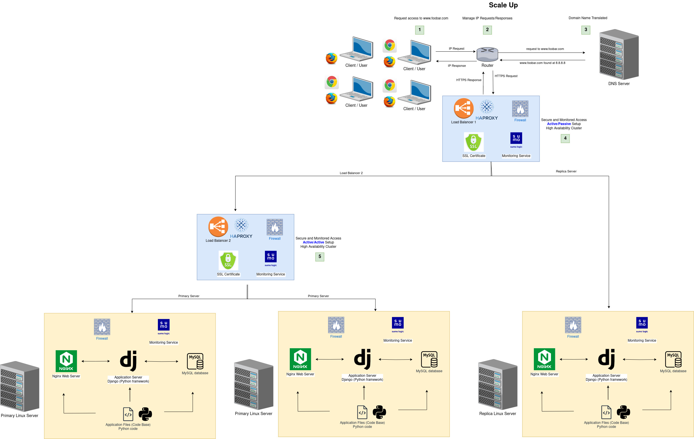

# 3. Scale up

## Table of contents

  * [Scale up](#scale-up)
      * [Specifics about this infrastructure](#specifics-about-this-infrastructure)
      * [Issues about this infrastructure](#issues-about-this-infrastructure)
  * [Bibliography](#bibliography)
  * [Tools](#tools)

## Scale up

The following is an improvement of the three server web infrastructure in the sense of scalability, the infrastructure hosts the website `www.foobar.com`, it must be secured, serve encrypted traffic, and be monitored

  

### Specifics about this infrastructure

- __Explain why are you adding every additional element__

The load balancer is configured as a cluster so that if one fails, the other balancer is still working.

Servers containing a single component inside them were added (such as a web server, application server or database)

### Issues about this infrastructure

- `Increased Complexity`, because maintaining servers with individual components can be more complex and require additional effort.

- `Resource Underutilization`, because if servers are dedicated to host a single component, it can result in resource underutilization. 

- `Higher Costs` because having dedicated servers for each component can result in increased costs. Each server requires hardware and maintenance.

## Bibliography:

- https://docs.oracle.com/en/solutions/autoscale-webapp/index.html#GUID-BA16E194-D871-4A39-8385-1CE4A8E6565D
- https://betterprogramming.pub/how-to-effectively-scale-your-web-application-7e3917bb98f

## Tools:
- https://app.diagrams.net/
