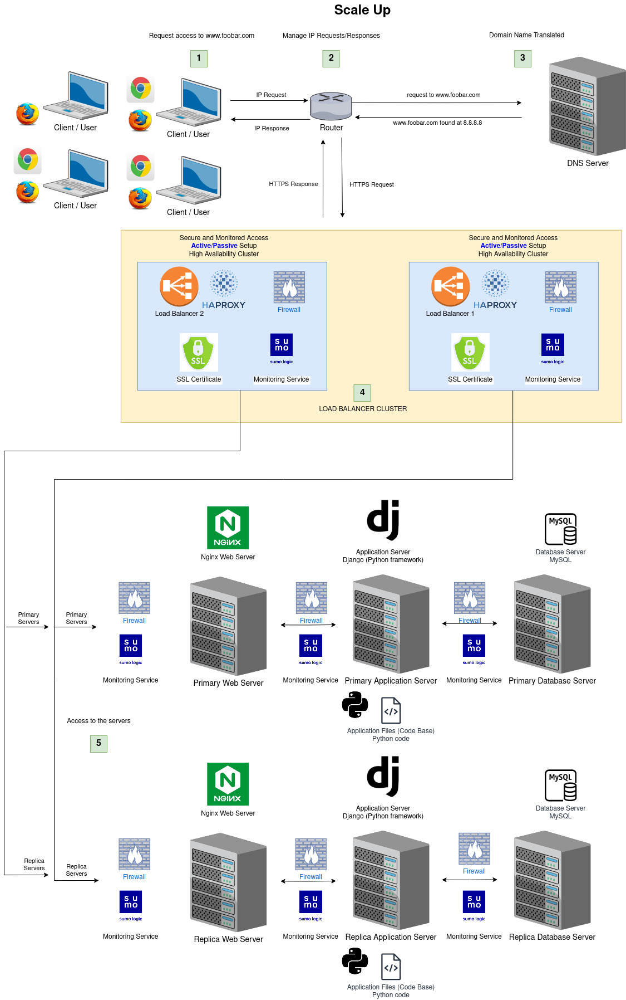

# 3. Scale up

## Table of contents

  * [Scale up](#scale-up)
      * [Specifics about this infrastructure](#specifics-about-this-infrastructure)
      * [Issues about this infrastructure](#issues-about-this-infrastructure)
  * [Bibliography](#bibliography)
  * [Tools](#tools)

## Scale up

The following is an improvement of the three server web infrastructure that hosts the website `www.foobar.com`, it must be secured, serve encrypted traffic, and be monitored

  

### Specifics about this infrastructure

- For every additional element, why you are adding it

## Bibliography:

- https://docs.oracle.com/en/solutions/autoscale-webapp/index.html#GUID-BA16E194-D871-4A39-8385-1CE4A8E6565D
- https://betterprogramming.pub/how-to-effectively-scale-your-web-application-7e3917bb98f

## Tools:
- https://app.diagrams.net/
